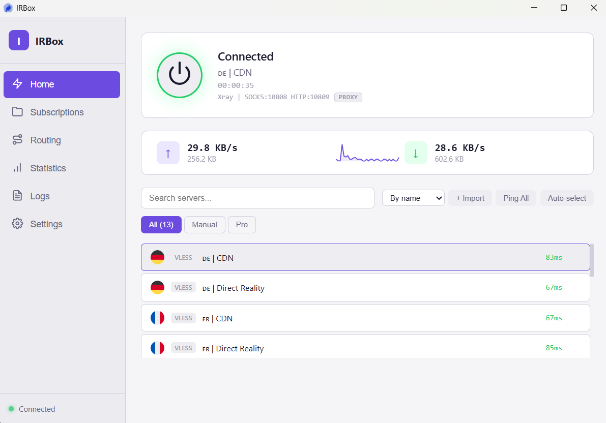

<div align="center">

# 🌐 IRBox Client



**A versatile and secure proxy client built with modern technologies to provide seamless and reliable internet connectivity**

Designed for privacy-conscious users, IRBox offers multi-protocol support, advanced routing capabilities, and intuitive management tools to ensure a smooth and secure browsing experience.

[](LICENSE) 
[](https://github.com/frank-vpl/IRBox/releases/latest)
[](https://github.com/frank-vpl/IRBox/releases/latest)

[Farsi Version](README_FA.md)

</div>

## 🚀 Key Features

### Multi-Protocol Support
- **VLESS**
- **VMess**
- **Shadowsocks**
- **Trojan**
- **Hysteria2**
- **TUIC**
- **SSH**
- **WireGuard**

### Advanced Management
- **Subscription Support** - Import and auto-update subscription URLs
- **Routing Rules** - Domain-based rules (proxy/direct/block) with presets for ad blocking and regional bypass
- **Split Tunneling** - Choose default route: proxy all traffic or selected domains

### Connection Modes
- **System Proxy** - HTTP proxy for system-wide access
- **TUN Mode** - Full VPN capturing all traffic
- **Admin Elevation** - One-click "Run as Administrator" for TUN mode

### User Experience
- **Onboarding** - Interactive guided tour for first-time users
- **TCP Ping** - Bulk server latency testing
- **Auto-select Best Server** - Intelligent server selection
- **Themes** - 2 color themes (Dark, Light)
- **Styles** - Default, Minimal

## 🛠️ Installation

### Prerequisites
- Rust and Cargo
- Tauri CLI
- NodeJS and NPM 
- Tauri prerequisites

### Quick Setup

1. **Clone the repository**
   ```bash
   git clone https://github.com/frank-vpl/IRBox.git
   cd IRBox
   ```

2. **Install dependencies**
   ```bash
   npm install
   ```
   
3. **Install Tauri CLI**
   ```bash
   cargo install tauri-cli --version ^2
   ```

4. **Download cores**

   **Windows:**
   ```bash
   ./cores.bat
   ```
   
   **Linux/macOS:**
   ```bash
   chmod +x cores.sh
   ./cores.sh
   ```

## 🚀 Usage

### Development
```bash
cargo tauri dev
```

### Production
```bash
cargo tauri build
```

## 🤝 Contributing

Contributions are welcome! Please feel free to submit a Pull Request. For major changes, please open an issue first to discuss what you would like to change.

## 📄 License

This project is licensed under the GNU General Public License v3.0 (GPL-3.0) - see the [LICENSE](LICENSE) file for details.

### Core Technologies

IRBox leverages the power of two leading proxy technologies:

<div align="center">

| Core | Description |
|------|-------------|
| [Xray-core](https://github.com/XTLS/Xray-core) | A platform for building proxies to bypass network restrictions |
| [sing-box](https://github.com/SagerNet/sing-box) | The universal proxy platform |

</div>

### Licenses of Third-Party Libraries

- [Rust](https://www.rust-lang.org/) - [License](./licenses/rust.md)
- [Tauri](https://v2.tauri.app/) - [License](./licenses/tauri.md)
- [sing-box](https://github.com/SagerNet/sing-box) - [License](./licenses/sing-box.md)
- [Xray-core](https://github.com/XTLS/Xray-core) - [License](./licenses/xray.md)

## 🙏 Acknowledgments

- Built with [Tauri](https://tauri.app/) - Framework for building secure native apps
- Powered by [sing-box](https://github.com/SagerNet/sing-box) and [Xray-core](https://github.com/XTLS/Xray-core)
- Inspired by the need for secure and flexible VPN solutions

## 📚 Documentation
[IRBox Documentation](./docs/README.md)

## 🎨 Design Assets

<div align="center">

### App Logo & Icons


- Icons by Hossein Pira – [PiraIcons](https://github.com/code3-dev/piraicons-assets) - [License](./licenses/piraicons.md)

</div>

## 🧩 Technologies Used

<div align="center">

### Frontend Dependencies


### Framework & Core


</div>

### Dependencies
- [react](https://react.dev/) - A JavaScript library for building user interfaces
- [react-dom](https://reactjs.org/docs/react-dom.html) - Provides DOM-specific methods that can be used at the top level of your app
- [@tauri-apps/api](https://github.com/tauri-apps/tauri) - Tauri API bindings
- [@tauri-apps/plugin-deep-link](https://github.com/tauri-apps/plugins-workspace) - Tauri plugin for deep linking
- [@tauri-apps/plugin-shell](https://github.com/tauri-apps/plugins-workspace) - Tauri plugin for shell operations

#### Development Dependencies
- [typescript](https://www.typescriptlang.org/) - TypeScript is a typed superset of JavaScript that compiles to plain JavaScript
- [vite](https://vitejs.dev/) - Next generation frontend tooling
- [@vitejs/plugin-react](https://github.com/vitejs/vite-plugin-react) - Vite plugin for React projects
- [@tauri-apps/cli](https://github.com/tauri-apps/tauri) - Tauri Command Line Interface
- [@types/react](https://www.npmjs.com/package/@types/react) - Type definitions for React
- [@types/react-dom](https://www.npmjs.com/package/@types/react-dom) - Type definitions for ReactDOM